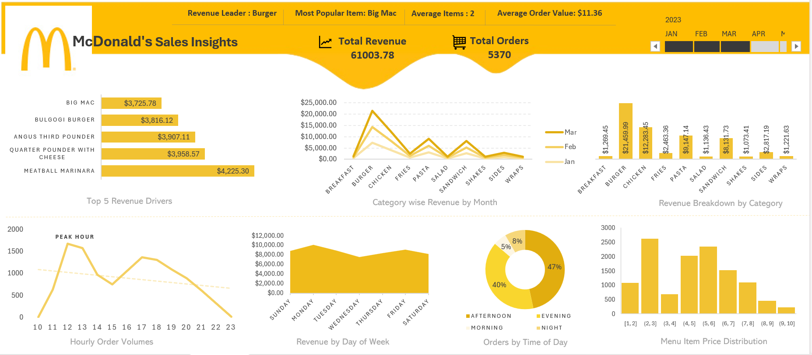

# Excel Dashboard Projects

This repository contains interactive **Excel dashboard projects** built using real-world datasets to demonstrate **data analysis, visualization, and business insights**.

## Project: McDonald's Sales Dashboard

This project analyzes McDonald's sales data and presents key business insights through an interactive Excel dashboard.

### Dashboard Overview

The dashboard provides a comprehensive view of sales performance including:

* Total Revenue
* Total Orders
* Category-wise Revenue
* Top Revenue Driving Menu Items
* Revenue by Day of Week
* Hourly Order Volume
* Orders by Time of Day
* Menu Item Price Distribution

### Tools & Techniques Used

* Microsoft Excel
* Pivot Tables
* Pivot Charts
* Data Cleaning
* Interactive Dashboard Design
* Business Data Analysis

### Key Insights

* Burger category generates the highest revenue.
* Big Mac is one of the most popular menu items.
* Afternoon and evening periods show the highest order volumes.
* Sales patterns vary across weekdays and peak hours.

### Dashboard Preview

### Dataset Files

* Menu Items Data
* Order Details Data

### Author

**Tushar Dhamankar**

Business Analyst | Data Analytics Enthusiast
